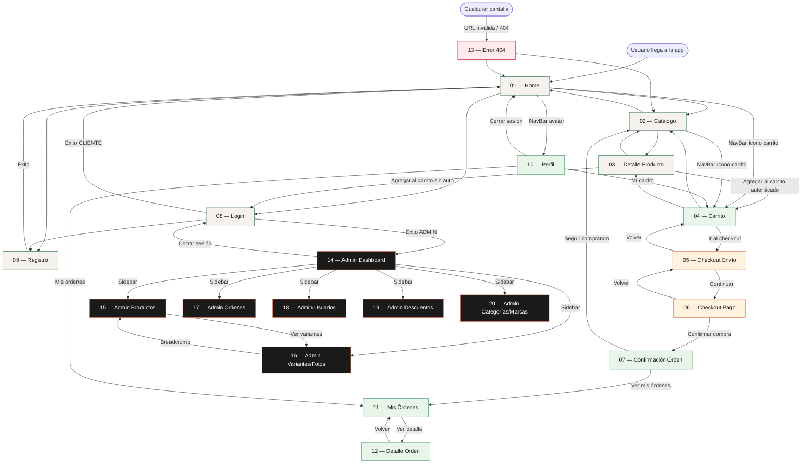

# Navigation Flow — TrailForge

---

## 1. Diagrama de navegación (Mermaid)

---

## 2. Tabla resumen de pantallas

| # | Pantalla | Archivo | Autenticación requerida |
|---|----------|---------|------------------------|
| 01 | Home | `screens/01-home.md` | No (pública) |
| 02 | Catálogo | `screens/02-catalogo.md` | No (pública) |
| 03 | Detalle Producto | `screens/03-detalle-producto.md` | No para ver; Sí para agregar al carrito |
| 04 | Carrito | `screens/04-carrito.md` | Sí — CLIENTE o ADMIN |
| 05 | Checkout — Envío | `screens/05-checkout-envio.md` | Sí — CLIENTE |
| 06 | Checkout — Pago | `screens/06-checkout-pago.md` | Sí — CLIENTE |
| 07 | Confirmación de Orden | `screens/07-confirmacion-orden.md` | Sí — CLIENTE |
| 08 | Login | `screens/08-login.md` | No (pública) |
| 09 | Registro | `screens/09-registro.md` | No (pública) |
| 10 | Perfil de Usuario | `screens/10-perfil.md` | Sí — CLIENTE o ADMIN |
| 11 | Mis Órdenes | `screens/11-mis-ordenes.md` | Sí — CLIENTE (ve solo las propias) |
| 12 | Detalle de Orden | `screens/12-detalle-orden.md` | Sí — CLIENTE (ownership) o ADMIN |
| 13 | Error 404 | `screens/13-error-404.md` | No (pública) |
| 14 | Admin — Dashboard | `screens/14-admin-dashboard.md` | Sí — solo ADMIN |
| 15 | Admin — Productos | `screens/15-admin-productos.md` | Sí — solo ADMIN |
| 16 | Admin — Variantes y Fotos | `screens/16-admin-variantes.md` | Sí — solo ADMIN |
| 17 | Admin — Órdenes | `screens/17-admin-ordenes.md` | Sí — solo ADMIN |
| 18 | Admin — Usuarios | `screens/18-admin-usuarios.md` | Sí — solo ADMIN |
| 19 | Admin — Descuentos | `screens/19-admin-descuentos.md` | Sí — solo ADMIN |
| 20 | Admin — Categorías y Marcas | `screens/20-admin-categorias-marcas.md` | Sí — solo ADMIN |

---

## 3. Resumen final

### Totales

| Métrica | Cantidad |
|---------|----------|
| **Pantallas totales** | **20** |
| Pantallas públicas (sin auth) | 6 (Home, Catálogo, Detalle, Login, Registro, 404) |
| Pantallas de cliente autenticado | 7 (Carrito, Checkout ×2, Confirmación, Perfil, Mis Órdenes, Detalle Orden) |
| Pantallas exclusivas de admin | 7 (Dashboard, Productos, Variantes/Fotos, Órdenes, Usuarios, Descuentos, Categorías/Marcas) |

### Componentes únicos identificados
| # | Componente |
|---|-----------|
| 1 | ProductCard |
| 2 | VariantSelector |
| 3 | CartItem |
| 4 | OrderItem |
| 5 | PriceDisplay |
| 6 | DiscountBadge |
| 7 | StockBadge |
| 8 | SeasonBadge |
| 9 | StatusBadge |
| 10 | NavBar |
| 11 | AdminSidebar |
| 12 | Breadcrumb |
| 13 | FilterPanel |
| 14 | QuantityInput |
| 15 | EmptyState |
| 16 | SkeletonCard |
| 17 | FormInput |
| 18 | PrimaryButton |
| 19 | SecondaryButton |
| 20 | DangerButton |
| 21 | StepIndicator |
| 22 | ImageGallery |
| 23 | DataTable |
| 24 | ConfirmDialog |
| 25 | Toast |

**Total: 25 componentes reutilizables**

### Tokens de color utilizados

| Token | Hex | Pantallas principales |
|-------|-----|-----------------------|
| `--color-primary` | `#2D6A4F` | Todas (botones CTA, links) |
| `--color-secondary` | `#E76F51` | Badges de descuento, alertas |
| `--color-bg` | `#F5F2EE` | Fondo global |
| `--color-surface` | `#FFFFFF` | Cards, modales, formularios |
| `--color-text-primary` | `#1A1A18` | Títulos, precios |
| `--color-text-secondary` | `#5C5C56` | Subtítulos, metadatos |
| `--color-success` | `#40916C` | Stock ok, órdenes confirmadas |
| `--color-warning` | `#F4A261` | Stock bajo, órdenes pendientes |
| `--color-error` | `#C1121F` | Errores, cancelaciones, sin stock |
| `--color-neutral-100` | `#F5F2EE` | Filas alternas en tablas |
| `--color-neutral-300` | `#D4CFC8` | Bordes, divisores |
| `--color-neutral-600` | `#8C8880` | Iconos inactivos, labels |
| `--color-neutral-900` | `#1A1A18` | Texto oscuro máximo |

**Total: 13 tokens de color**

### Endpoints cubiertos

| Recurso | Endpoints cubiertos |
|---------|---------------------|
| Auth | POST /login, POST /register |
| Productos | GET all, GET by id, GET by categoria, GET by marca, GET by estado, POST, PUT, DELETE, GET disponible |
| Variantes | GET all, GET by id, GET precio, GET stock/disponible, POST, PUT, DELETE |
| Categorías | GET all, GET by id, POST, PUT, DELETE |
| Marcas | GET all, GET by id, POST, PUT, DELETE |
| Fotos | GET all, GET by id, GET by variante, POST (multipart), PUT, DELETE |
| Carrito | GET, POST, PUT, DELETE, POST items, DELETE items, PUT items, GET items, GET total, POST vaciar, POST checkout |
| Órdenes | GET all, GET by id, POST, PUT, DELETE, POST confirmar, POST cancelar, GET monto-final, GET items, GET by usuario |
| Descuentos | GET all, GET activos, GET by id, POST, PUT, DELETE, GET vigente, GET calcular |
| Usuarios | GET all, GET by id, POST, PUT, DELETE |

**Total: 48 endpoints cubiertos de los 50 disponibles en el backend**

---

### Flujos críticos de negocio mapeados

1. **Flujo de compra** — Home → Catálogo → Detalle → Carrito → Checkout Envío → Checkout Pago → Confirmación
2. **Flujo de autenticación** — Login / Registro → redirect con JWT
3. **Flujo de gestión de carrito** — Agregar / modificar cantidad / eliminar ítems / aplicar descuento / checkout
4. **Flujo de órdenes** — Checkout crea PENDIENTE → Confirmar → (futuro: Entregar); Cancelar desde cualquier estado activo
5. **Flujo admin de productos** — Crear Producto → Crear Variantes → Subir Fotos → Publicar (ACTIVO)
6. **Flujo de descuentos** — Crear con fechas → Auto-expiración por job diario → Aplicar al carrito
7. **Flujo de carritos abandonados** — Job semanal marca como ABANDONADO carritos sin actividad por 7+ días
