# Documentación Técnica de Arquitectura
## Trekking Ecommerce API

**Proyecto:** TP-APIS-ecommerce-1C  
**Framework:** Spring Boot 3.5.12 · Java 17 · Maven  
**Paquete raíz:** `com.trekking.ecommerce`

---

## 1. Diagrama de Arquitectura en Capas

```mermaid
flowchart TD
    %% ── CLIENTE ──────────────────────────────────────────────────────────
    CLIENT(["🌐 HTTP Client\nSwagger UI / Frontend / Postman"])

    %% ── CAPA DE SEGURIDAD ────────────────────────────────────────────────
    subgraph SEC ["🔒 Capa de Seguridad — config/SecurityBeansConfig.java"]
        direction TB
        CORS_CFG["CorsConfigurationSource\n• allowedOrigins: *\n• methods: GET POST PUT DELETE OPTIONS\n• allowCredentials: true"]
        JWT_FILTER["JwtAuthenticationFilter\n(OncePerRequestFilter)\nsecurity/JwtAuthenticationFilter.java"]
        JWT_UTIL["JwtUtil.java\n• generateToken(UserDetails)\n• validateToken(token)\n• extractUsername(token)\n• HMAC-SHA256 · 24h expiry"]
        UDS["UserDetailsServiceImpl.java\n• loadUserByUsername(username)\n• consulta UsuarioRepository"]
        DAO_PROVIDER["DaoAuthenticationProvider\n• userDetailsService → UserDetailsServiceImpl\n• passwordEncoder → BCryptPasswordEncoder(10)"]
        AUTH_MANAGER["AuthenticationManager\n• autentica en /api/auth/login"]
        SEC_CONTEXT["SecurityContextHolder\n• almacena Authentication\n• roles: ROLE_ADMIN / ROLE_CLIENTE"]
        AUTHZ_FILTER["AuthorizationFilter\n• evalúa requestMatchers\n• hasRole() / permitAll() / authenticated()"]
        EX_HANDLER["ExceptionTranslationFilter\n→ GlobalExceptionHandler.java\n• 401 BadCredentialsException\n• 403 AccessDeniedException\n• 403 DisabledException"]
    end

    %% ── CAPA DE PRESENTACIÓN ─────────────────────────────────────────────
    subgraph PRES ["📡 Capa de Presentación — controller/"]
        direction TB
        subgraph CTRL_AUTH ["Autenticación"]
            C1["AuthController\nPOST /api/auth/login\nPOST /api/auth/register"]
        end
        subgraph CTRL_PUB ["Lectura Pública (GET)"]
            C2["ProductoController\nGET /api/productos/**"]
            C3["CategoriaController\nGET /api/categorias/**"]
            C4["MarcaController\nGET /api/marcas/**"]
            C5["VarianteProductoController\nGET /api/variantes/**"]
            C6["FotoController\nGET /api/fotos/**"]
        end
        subgraph CTRL_AUTH2 ["Autenticado (CLIENTE + ADMIN)"]
            C7["CarritoController\n/api/carritos/**"]
            C8["OrdenController\n/api/ordenes/**"]
            C9["DescuentoController\nGET /api/descuentos/activos"]
        end
        subgraph CTRL_ADMIN ["Solo ADMIN"]
            C10["UsuarioController\n/api/usuarios/**"]
            C11["POST/PUT/DELETE\n/api/productos/**\n/api/categorias/**\n/api/marcas/**\n/api/variantes/**\n/api/fotos/**\n/api/descuentos/**"]
        end
        BASE["AuthenticatedController.java\n(clase base — extrae usuario del contexto)"]
    end

    subgraph DTOS ["DTOs — dto/"]
        direction LR
        DREQ["Request DTOs\nLoginRequest · RegisterRequest\nProductoRequest · CarritoRequest\nItemCarritoRequest · OrdenRequest\nVarianteProductoRequest\nCategoriaRequest · MarcaRequest\nFotoRequest · DescuentoRequest\nUsuarioRequest"]
        DRES["Response DTOs\nAuthResponse · UsuarioResponse\nProductoResponse · CarritoResponse\nItemCarritoResponse · OrdenResponse\nItemOrdenResponse · CategoriaResponse\nMarcaResponse · VarianteProductoResponse\nFotoResponse · DescuentoResponse\nErrorResponse"]
    end

    %% ── CAPA DE NEGOCIO ──────────────────────────────────────────────────
    subgraph BIZ ["⚙️ Capa de Negocio — service/ + service/impl/"]
        direction TB
        S1["UsuarioServiceImpl\n• registro con BCrypt\n• gestión de estados y roles"]
        S2["ProductoServiceImpl\n• filtros por categoría/marca/estado\n• verificación de disponibilidad"]
        S3["CarritoServiceImpl\n• validación de stock\n• cálculo de totales\n• aplicación de descuentos\n• checkout → crea Orden"]
        S4["OrdenServiceImpl\n• creación desde carrito\n• transiciones de estado\n• precio al momento de compra"]
        S5["VarianteProductoServiceImpl\n• gestión de variantes\n• control de stock"]
        S6["CategoriaServiceImpl\nMarcaServiceImpl\nFotoServiceImpl\nDescuentoServiceImpl\nItemCarritoServiceImpl\nItemOrdenServiceImpl"]
        JOB["Scheduled Jobs — job/\n• limpieza de carritos abandonados\n• expiración de descuentos\n(@Scheduled · @EnableScheduling)"]
    end

    %% ── CAPA DE PERSISTENCIA ─────────────────────────────────────────────
    subgraph PERS ["🗄️ Capa de Persistencia — repository/ + model/"]
        direction TB
        subgraph REPOS ["Repositorios (JpaRepository<T, Long>)"]
            R1["UsuarioRepository\nfindByUsername · findByEmail"]
            R2["ProductoRepository\nfindByCategoriaId · findByMarcaId\nfindByEstado"]
            R3["CarritoRepository\nfindByUsuarioId · findByEstado"]
            R4["OrdenRepository\nfindByUsuarioId · findByEstado"]
            R5["ItemCarritoRepository\nfindByCarritoId"]
            R6["ItemOrdenRepository\nfindByOrdenId"]
            R7["VarianteProductoRepository\nfindByProductoId"]
            R8["CategoriaRepository\nMarcaRepository\nFotoRepository\nDescuentoRepository"]
        end
        subgraph ENTITIES ["Entidades JPA — model/"]
            E1["Usuario\n@Entity · id, username, email\npassword, nombre, apellido\nrol(enum), estado(enum)"]
            E2["Producto\n@Entity · id, nombre, descripcion\nprecioBase, estado(enum)\n→ Marca, → Categoria"]
            E3["VarianteProducto\n@Entity · color, talla, material\npeso, stock, precio, estacion(enum)\nUNIQUE(producto, color, talla)"]
            E4["Carrito\n@Entity · estado(enum), montoTotal\n@PrePersist/@PreUpdate fechaMod\n→ Usuario, → Descuento"]
            E5["Orden\n@Entity · fechaCreacion\nmontoFinal, estado(enum)\n→ Usuario, → Carrito, → Descuento"]
            E6["ItemCarrito · ItemOrden\nFoto · Categoria\nMarca · Descuento"]
            ENUMS["Enums — model/enums/\nRolUsuario · EstadoUsuario\nEstadoProducto · EstadoCarrito\nEstadoOrden · EstadoDescuento\nTipoDescuento · Estacion"]
        end
    end

    %% ── BASE DE DATOS ─────────────────────────────────────────────────────
    subgraph DB ["💾 Base de Datos"]
        H2[("H2 In-Memory\nperfil: local\ncreate-drop")]
        MYSQL[("MySQL 8+\nperfil: mysql / dev\nddl-auto: update")]
    end

    %% ── FLECHAS DE DEPENDENCIA ────────────────────────────────────────────
    CLIENT -->|"HTTP Request + Bearer JWT"| SEC
    SEC -->|"petición autenticada y autorizada"| PRES
    PRES <-->|"serializa / deserializa"| DTOS
    PRES -->|"delega lógica"| BIZ
    BIZ -->|"accede a datos"| PERS
    PERS -->|"JDBC / HQL"| DB

    JWT_FILTER -->|"valida token con"| JWT_UTIL
    JWT_FILTER -->|"carga usuario con"| UDS
    UDS -->|"consulta"| R1
    AUTH_MANAGER -->|"usa"| DAO_PROVIDER
    DAO_PROVIDER -->|"delega carga a"| UDS
    JWT_UTIL -->|"genera token para"| C1
    SEC_CONTEXT -->|"informa a"| AUTHZ_FILTER
    AUTHZ_FILTER -->|"rechaza con"| EX_HANDLER

    C7 & C8 -->|"hereda contexto de"| BASE
    S3 -->|"invoca en checkout"| S4
    JOB -->|"llama periódicamente a"| S3
    JOB -->|"llama periódicamente a"| S6

    ENTITIES --> ENUMS
    REPOS -->|"gestiona"| ENTITIES

    style SEC fill:#fff3cd,stroke:#f0ad4e,color:#000
    style PRES fill:#d1ecf1,stroke:#17a2b8,color:#000
    style DTOS fill:#e8f4f8,stroke:#17a2b8,color:#000
    style BIZ fill:#d4edda,stroke:#28a745,color:#000
    style PERS fill:#f8d7da,stroke:#dc3545,color:#000
    style DB fill:#e2e3e5,stroke:#6c757d,color:#000
```

---

## 2. Diagrama del Security Filter Chain

```mermaid
flowchart TD
    START(["🌐 HTTP Request entrante\nMétodo + URL + Headers"])

    %% ─── FILTRO 1: CORS ───────────────────────────────────────────────────
    CORS_F["① CorsFilter\nCorsConfigurationSource (SecurityBeansConfig)\nallowedOrigins=* · methods=GET,POST,PUT,DELETE,OPTIONS"]
    CORS_CHK{{"¿Es preflight\nOPTIONS?"}}
    CORS_OK["200 OK — sin continuar\nla cadena de filtros"]

    %% ─── FILTRO 2: CSRF ───────────────────────────────────────────────────
    CSRF_F["② CSRF Protection\n⛔ DESHABILITADO\ncsrf.disable() en SecurityBeansConfig\n(API stateless — sin sesión de navegador)"]

    %% ─── FILTRO 3: JWT ────────────────────────────────────────────────────
    JWT_F["③ JwtAuthenticationFilter\n(OncePerRequestFilter)\nsecurity/JwtAuthenticationFilter.java"]
    HDR_CHK{{"¿Header\nAuthorization: Bearer\npresente?"}}
    EXTRACT["Extrae token del header\nJwtUtil.extractUsername(token)"]
    TOKEN_CHK{{"¿Token válido?\n• Firma HMAC-SHA256 correcta\n• No expirado (< 24h)\n• Username extraíble"}}
    LOAD_USER["UserDetailsServiceImpl\n.loadUserByUsername(username)\n→ SELECT FROM usuario WHERE username=?"]
    USER_CHK{{"¿Usuario\nACTIVO?"}}
    SET_CTX["SecurityContextHolder\n.setAuthentication(\n  UsernamePasswordAuthenticationToken\n  + GrantedAuthorities[ROLE_X]\n)"]
    NO_TOKEN["No se establece Authentication\n(podría ser endpoint público)"]

    %% ─── FILTRO 4: ExceptionTranslation ──────────────────────────────────
    EX_F["④ ExceptionTranslationFilter\nCaptura excepciones de seguridad\n→ GlobalExceptionHandler.java"]

    %% ─── FILTRO 5: Authorization ──────────────────────────────────────────
    AUTHZ_F["⑤ AuthorizationFilter\nEvalúa requestMatchers definidos en SecurityBeansConfig"]

    PUB_CHK{{"¿Ruta\npública?"}}
    AUTH_CHK{{"¿Usuario\nautenticado?"}}
    ROLE_CHK{{"¿Tiene el\nrol requerido?"}}

    %% ─── DESTINOS FINALES ─────────────────────────────────────────────────
    CTRL(["✅ Controller\nEjecuta lógica de negocio"])
    R401(["❌ 401 Unauthorized\nBadCredentialsException\n/ token inválido o ausente"])
    R403_DIS(["❌ 403 Forbidden\nDisabledException\n(usuario INACTIVO)"])
    R403_ROLE(["❌ 403 Forbidden\nAccessDeniedException\n(rol insuficiente)"])

    %% ─── RUTAS PÚBLICAS ───────────────────────────────────────────────────
    subgraph PUBLIC_ROUTES ["Rutas públicas (permitAll)"]
        PR1["GET /api/productos/**\nGET /api/categorias/**\nGET /api/marcas/**\nGET /api/variantes/**\nGET /api/fotos/**"]
        PR2["POST /api/auth/login\nPOST /api/auth/register"]
        PR3["/swagger-ui.html\n/swagger-ui/**\n/v3/api-docs/**\n/api-docs/**"]
    end

    %% ─── RUTAS PROTEGIDAS ────────────────────────────────────────────────
    subgraph PROTECTED_ROUTES ["Rutas protegidas"]
        PRO1["authenticated()\nGET /api/descuentos/activos\n/api/carritos/**\n/api/ordenes/**"]
        PRO2["hasRole('ADMIN')\n/api/usuarios/**\nPOST/PUT/DELETE /api/productos/**\nPOST/PUT/DELETE /api/categorias/**\nPOST/PUT/DELETE /api/marcas/**\nPOST/PUT/DELETE /api/variantes/**\nPOST/PUT/DELETE /api/fotos/**\n/api/descuentos/** (excepto /activos)"]
    end

    %% ─── FLUJO ────────────────────────────────────────────────────────────
    START --> CORS_F
    CORS_F --> CORS_CHK
    CORS_CHK -->|"Sí (preflight)"| CORS_OK
    CORS_CHK -->|"No"| CSRF_F
    CSRF_F --> JWT_F

    JWT_F --> HDR_CHK
    HDR_CHK -->|"No"| NO_TOKEN
    HDR_CHK -->|"Sí"| EXTRACT
    EXTRACT --> TOKEN_CHK
    TOKEN_CHK -->|"Inválido / expirado"| R401
    TOKEN_CHK -->|"Válido"| LOAD_USER
    LOAD_USER --> USER_CHK
    USER_CHK -->|"INACTIVO"| R403_DIS
    USER_CHK -->|"ACTIVO"| SET_CTX
    SET_CTX --> EX_F
    NO_TOKEN --> EX_F

    EX_F --> AUTHZ_F
    AUTHZ_F --> PUB_CHK

    PUB_CHK -->|"Sí (permitAll)"| PUBLIC_ROUTES
    PUBLIC_ROUTES --> CTRL

    PUB_CHK -->|"No"| AUTH_CHK
    AUTH_CHK -->|"No autenticado"| R401
    AUTH_CHK -->|"Autenticado"| ROLE_CHK

    ROLE_CHK -->|"Solo autenticación requerida\nROLE_ADMIN o ROLE_CLIENTE"| PRO1
    ROLE_CHK -->|"ROLE_ADMIN requerido\ny usuario es CLIENTE"| R403_ROLE
    ROLE_CHK -->|"ROLE_ADMIN confirmado"| PRO2

    PRO1 --> CTRL
    PRO2 --> CTRL

    style START fill:#e3f2fd,stroke:#1565c0,color:#000
    style CTRL fill:#e8f5e9,stroke:#2e7d32,color:#000
    style R401 fill:#ffebee,stroke:#c62828,color:#000
    style R403_DIS fill:#ffebee,stroke:#c62828,color:#000
    style R403_ROLE fill:#ffebee,stroke:#c62828,color:#000
    style CORS_OK fill:#fff8e1,stroke:#f9a825,color:#000
    style PUBLIC_ROUTES fill:#f1f8e9,stroke:#558b2f,color:#000
    style PROTECTED_ROUTES fill:#fce4ec,stroke:#ad1457,color:#000
    style CSRF_F fill:#f5f5f5,stroke:#9e9e9e,color:#757575
```

---

## 3. Explicación Técnica

### 3.1 Arquitectura General

La aplicación implementa una **arquitectura en capas estricta** (_Layered Architecture_), patrón ampliamente adoptado en el ecosistema Spring por su separación de responsabilidades, testabilidad y bajo acoplamiento entre componentes. Las cuatro capas son impermeables hacia arriba: la capa de persistencia no conoce a los controllers, y los controllers no acceden directamente a los repositorios.

| Capa | Paquete | Responsabilidad |
|---|---|---|
| Presentación | `controller/` + `dto/` | Recibir requests HTTP, validar entradas con `@Valid`, delegar al service y serializar la respuesta. Sin lógica de negocio. |
| Seguridad | `config/SecurityBeansConfig` + `security/` | Interceptar toda petición antes de llegar al controller. Valida JWT, establece el contexto de autenticación y aplica reglas de autorización por rol. |
| Negocio | `service/` + `service/impl/` | Lógica de dominio: cálculo de totales, validación de stock, proceso de checkout, transiciones de estado. Marcado con `@Transactional` para garantizar atomicidad. |
| Persistencia | `repository/` + `model/` | Contratos de acceso a datos via Spring Data JPA. Hibernate genera el SQL; las entidades mapean el esquema relacional con anotaciones JPA estándar. |

El stack tecnológico detectado es: **Spring Boot 3.5.12**, **Java 17**, **Spring Security 6**, **JJWT 0.12.3** (HMAC-SHA256), **Hibernate ORM** (incluido en Spring Data JPA), **H2** (perfil `local`) y **MySQL 8+** (perfiles `mysql` y `dev`), con documentación automática via **springdoc-openapi 2.8.6** (Swagger UI).

---

### 3.2 Flujo de Autenticación y Autorización

El mecanismo de seguridad es **JWT stateless**: no se utilizan sesiones HTTP (`SessionCreationPolicy.STATELESS`) ni CSRF (deshabilitado explícitamente, ya que no hay cookies de sesión que proteger).

**Paso a paso:**

1. El cliente realiza `POST /api/auth/login` con `{ username, password }`.
2. `AuthController` invoca al `AuthenticationManager`, que delega en `DaoAuthenticationProvider`.
3. `DaoAuthenticationProvider` llama a `UserDetailsServiceImpl.loadUserByUsername()` → consulta `UsuarioRepository.findByUsername()` → verifica la contraseña con `BCryptPasswordEncoder` (strength 10).
4. Si las credenciales son válidas, `JwtUtil.generateToken()` produce un token firmado con HMAC-SHA256, con el username como `subject` y expiración de 24 horas.
5. El token se devuelve en `AuthResponse { token, username, rol }`.
6. En las siguientes peticiones, el cliente incluye `Authorization: Bearer <token>`.
7. `JwtAuthenticationFilter` (ejecutado una sola vez por request como `OncePerRequestFilter`) extrae el token, valida la firma y la expiración, carga el usuario y establece la autenticación en `SecurityContextHolder`.
8. `AuthorizationFilter` evalúa los `requestMatchers` y aplica `hasRole()` / `authenticated()` / `permitAll()` según la ruta.

---

### 3.3 Endpoints por Nivel de Acceso

**Públicos (`permitAll`):** `GET /api/productos/**`, `GET /api/categorias/**`, `GET /api/marcas/**`, `GET /api/variantes/**`, `GET /api/fotos/**`, `POST /api/auth/login`, `POST /api/auth/register`, y toda la documentación Swagger (`/swagger-ui/**`, `/v3/api-docs/**`).

**Autenticados (`authenticated` — CLIENTE o ADMIN):** `/api/carritos/**`, `/api/ordenes/**`, `GET /api/descuentos/activos`. Los endpoints de carrito y orden realizan además una validación de **propiedad del recurso** en el service (el usuario autenticado solo puede acceder a sus propios carritos y órdenes).

**Solo ADMIN (`hasRole("ADMIN")`):** `POST/PUT/DELETE` sobre productos, categorías, marcas, variantes, fotos y descuentos; y la totalidad de `/api/usuarios/**`.

---

### 3.4 Modelo de Persistencia

El dominio modela un e-commerce de productos de trekking con las siguientes entidades principales y relaciones:

- **`Usuario`** → tiene muchos **`Carrito`** y muchas **`Orden`**. Posee un `RolUsuario` (ADMIN / CLIENTE) y un `EstadoUsuario` (ACTIVO / INACTIVO).
- **`Producto`** → pertenece a una **`Categoria`** y una **`Marca`**; tiene muchas **`VarianteProducto`** (combinaciones únicas de `color + talla`).
- **`VarianteProducto`** → tiene muchas **`Foto`**, puede aparecer en muchos **`ItemCarrito`** e **`ItemOrden`**. Tiene constraint `UNIQUE(id_producto, color, talla)`.
- **`Carrito`** → pertenece a un `Usuario`, puede tener un `Descuento` aplicado, contiene muchos **`ItemCarrito`** y puede originar una **`Orden`**.
- **`Orden`** → pertenece a un `Usuario`, referencia opcionalmente al `Carrito` de origen y a un `Descuento`. Contiene muchos **`ItemOrden`** que registran el `precioAlMomento` de compra, preservando el historial ante futuros cambios de precio.
- **`Descuento`** → puede ser de tipo `PORCENTAJE` o `FIJO`, con rango de fechas de vigencia. Puede aplicarse tanto a `Carrito` como a `Orden`.

La estrategia de DDL es `create-drop` en el perfil `local` (H2) y `update` en los perfiles con MySQL. Los enums se persisten como `String` (`@Enumerated(EnumType.STRING)`) para legibilidad y resistencia al refactoring. La sesión abierta en vista está desactivada (`spring.jpa.open-in-view=false`), forzando que toda carga lazy ocurra dentro de los límites transaccionales de la capa de negocio.
